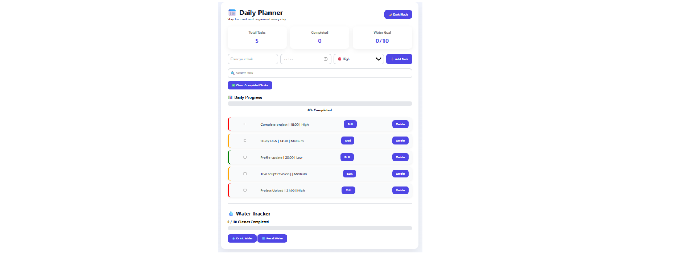
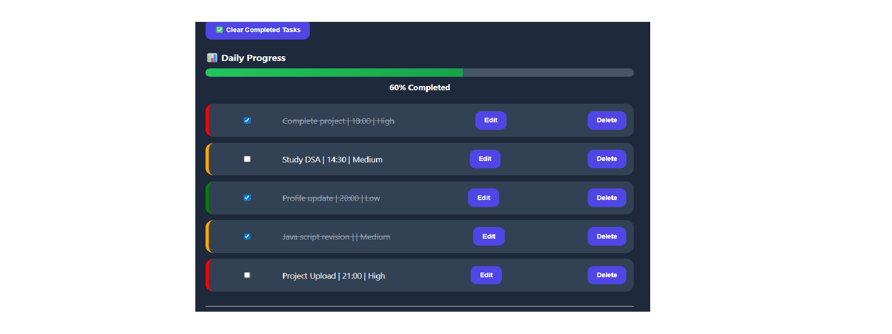
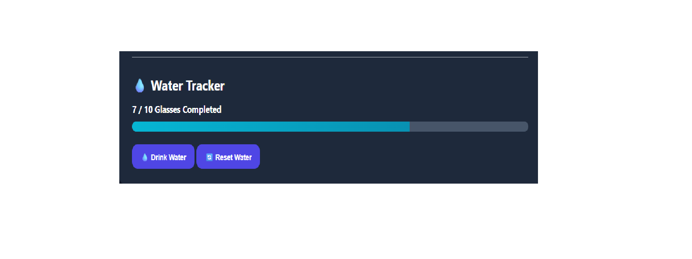
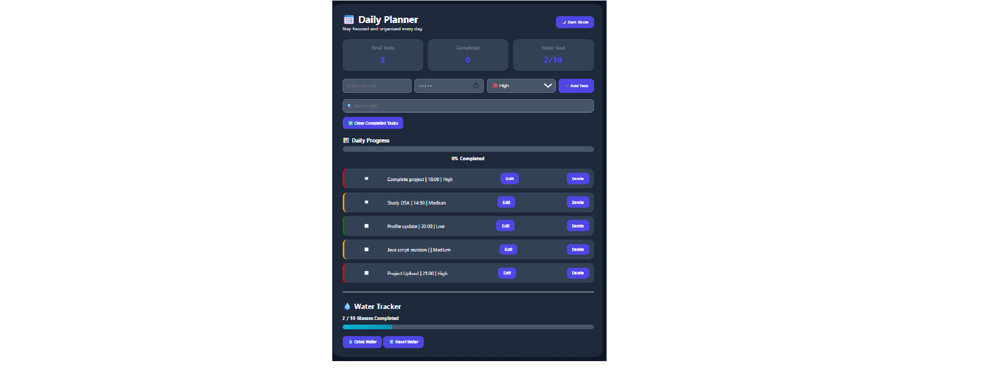

# 📅 Daily Planner App

A modern productivity-focused Progressive Web App (PWA) built using HTML, CSS, and JavaScript.

The application helps users organize daily activities, track task completion, monitor water intake, and stay productive through reminders and progress tracking.

---

## ✨ Features

### ✅ Task Management

- Add new tasks
- Edit existing tasks
- Delete tasks
- Mark tasks as completed
- Search tasks instantly

### 🎯 Priority Management

- High Priority Tasks
- Medium Priority Tasks
- Low Priority Tasks
- Visual priority indicators

### 📊 Productivity Dashboard

- Total Tasks Counter
- Completed Tasks Counter
- Progress Tracking
- Completion Percentage

### 💧 Water Intake Tracker

- Daily water goal tracking
- Progress bar visualization
- One-click water logging
- Daily reset option

### 🔔 Reminder System

- Time-based task reminders
- Browser notifications
- Task alerts

### 🌙 User Experience

- Dark Mode support
- Responsive design
- Modern UI
- Mobile-friendly layout

### 📱 Progressive Web App (PWA)

- Installable on devices
- Offline support
- Service Worker integration
- App Manifest configuration

### 💾 Data Persistence

- Local Storage support
- Automatic data saving
- Persistent task history

---

## 🛠️ Technologies Used

- HTML5
- CSS3
- JavaScript (ES6)
- Local Storage API
- Progressive Web App (PWA)
- Service Workers

---

## 📸 Screenshots

### Dashboard



### Task Management



### Water Tracker



### Dark Mode



---

## 🚀 Live Demo

https://riya-builds.github.io/daily-planner-app/

---

## 🚀 Getting Started

### Clone the Repository

```bash
git clone https://github.com/riya-builds/daily-planner-app.git
```

### Open Project

```bash
cd daily-planner-app
```

### Run Locally

Open `index.html` directly in a browser or run using VS Code Live Server.

---

## 📂 Project Structure

```text
daily-planner-app/
│
├── screenshots/
│   ├── dashboard.png
│   ├── tasks.png
│   ├── water-tracker.png
│   └── dark-mode.png
│
├── index.html
├── style.css
├── script.js
├── manifest.json
├── service-worker.js
├── icon.png
└── README.md
```

---

## 🔮 Future Improvements

- User Authentication
- Cloud Data Sync
- Firebase Integration
- Categories and Tags
- Weekly Analytics
- Custom Themes
- Advanced Notifications

---

## 👩‍💻 Author

Riya

B.Tech CSE (Cyber Security)

Passionate about software development, cybersecurity, and building practical projects.

---

## ⭐ Support

If you found this project useful, consider giving it a star on GitHub.